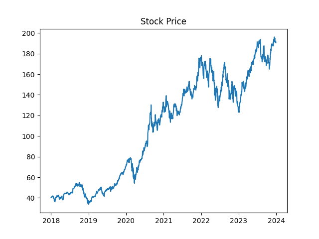
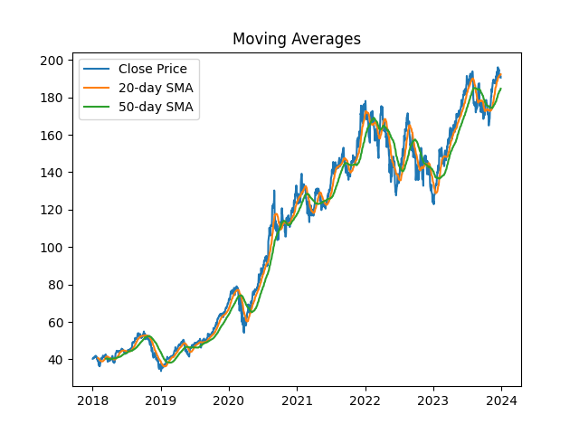
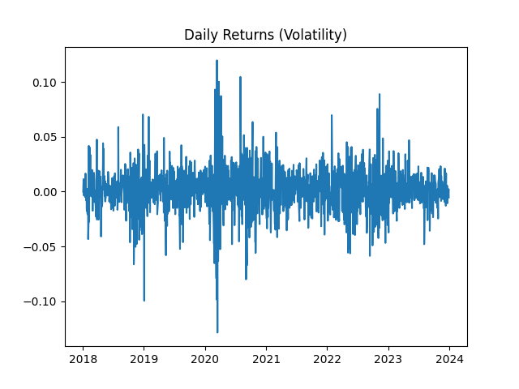

# 📊 Stock Market Data Analysis

## Overview
Analyzed historical stock price data using Python to identify trends, volatility, and investment signals.

## Tools Used
- Python (Pandas, NumPy)
- Matplotlib
- yfinance

## Key Analysis
- Price trend analysis
- Moving averages (20-day, 50-day)
- Volatility measurement
- Comparative stock analysis

## Insights
- Identified bullish/bearish signals using moving averages
- Evaluated risk using daily returns
- Compared multiple stocks for performance trends

## Visualizations

## Conclusion
This project demonstrates how data analysis can support investment decisions using historical trends and statistical techniques.
